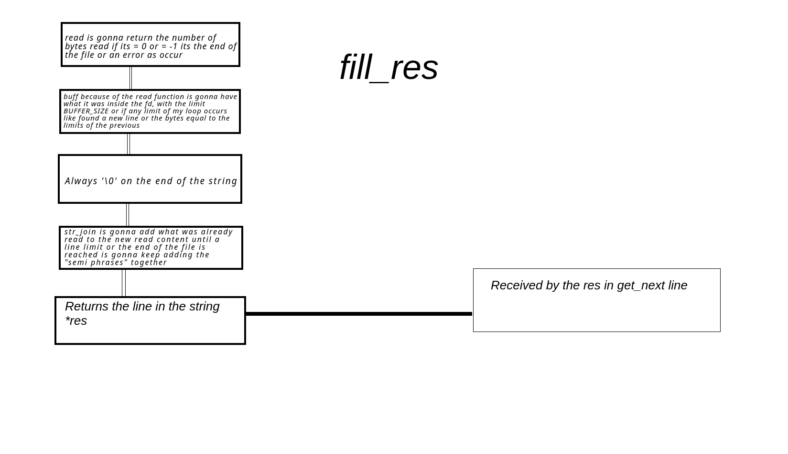
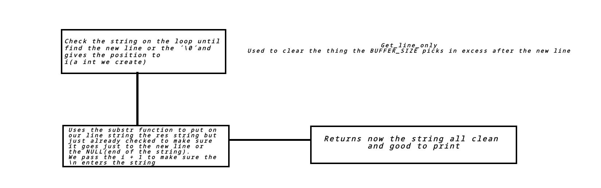
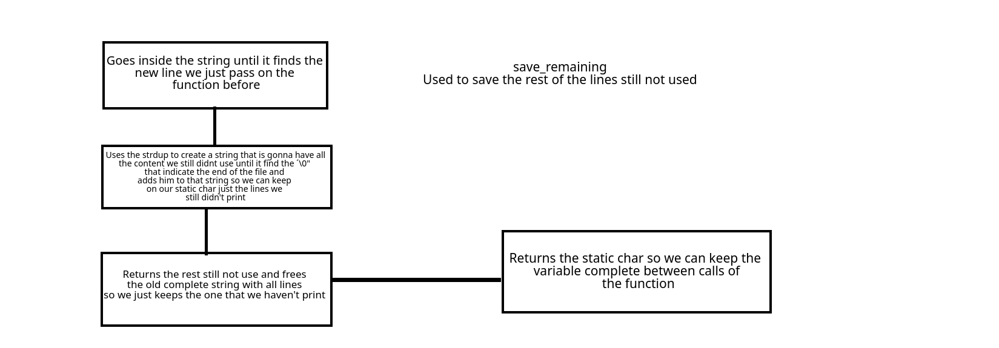

*This project has been created as part of the 42 curriculum by pneto-vi.*

# Description

The get_next_line function reads content from a file and returns a single line per call. A line is defined as a sequence of characters ending with a newline (\n) or the end of the file.

# Parameter	Description

fd	The file descriptor to read from.
Return Value	The line read (including the newline character if present) or NULL if an error occurs or the end of the file is reached.

# Logical Workflow

Open the file and pass it to fd, after that we call the function get_next line

Get_next line:

Fill_res:

Calls the function fill_res that is going to read the file and pass the whole line in a loop to the string res like this (can take more than its supposed if the BUFFER_SIZE is to big that's why we call the next function get_line_only).

Get_line_only:

When we receive the res string after the fill_res it can contain more than just the line if the BUFFER_SIZE is too big because the read reads the file in "chunks" so we use this function to verify if it's just the line that is there.

Save_remaining:

We save the rest of the file still not read on a static char so we can keep it between function, so we don't read the same line over and over again.

# Instructions

To integrate the function into a project, include the source files and define the buffer size during compilation or use the default that as been defined in the header.

Compilation

Example using a buffer size of 32:
Bash

gcc -Wall -Wextra -Werror -D BUFFER_SIZE=32 get_next_line.c get_next_line_utils.c

# Files Structure

    get_next_line.c: Contains the primary logic for the function.

    get_next_line_utils.c: Contains helper functions required for string manipulation (e.g., length calculation, joining, and searching).

    get_next_line.h: The header file containing function prototypes and necessary includes.

# Resources

Visual Learning: I utilized YouTube tutorials to visualize how the read() and open() functions operate at a system level, specifically how the file pointer moves during execution.

Research: I used technical forums such as GeeksforGeeks to clarify C syntax and AI tools to help structure the documentation for better readability(grammatically). Also used the paint to make my workflow more understandable for new viewers.